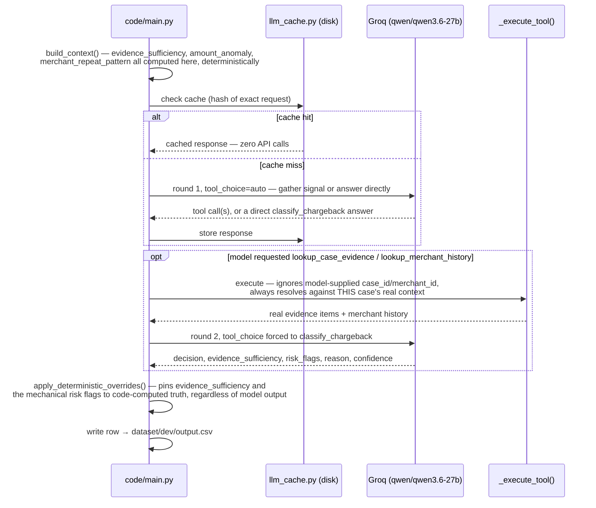

# Architecture

**Chargeback Evidence Responder — Razorpay AI Buildathon 2026, Track 2 (AI Risk Manager)**

This is the standalone architecture document referenced as a required
submission. It overlaps with the README by design (the README is what a
visitor reads first; this is what a reviewer evaluating the architecture
specifically reads next) — component list, data flow, and design
rationale live here in one place rather than split across files.

## 1. What the system does

One class of loss: chargebacks. Given a chargeback case (reason code,
transaction, merchant-submitted evidence, merchant narrative, merchant
history), the system outputs a decision — `contest`, `accept_liability`,
or `manual_review` — plus evidence sufficiency, risk flags, a grounded
justification, a confidence score, and the specific evidence IDs cited.

## 2. Components

| Component | File | Role |
|---|---|---|
| `KeyPool` | `code/main.py` | Round-robins across every `GROQ_API_KEY*` found in the environment; marks a key dead on auth failure or daily-cap exhaustion so later calls skip it. |
| `ResponseCache` | `code/llm_cache.py` | Disk cache keyed by a hash of the exact LLM request. Checked before every call, written after every success. Makes re-running the pipeline over already-seen cases free. |
| `risk_signals` | `code/risk_signals.py` | Computes evidence sufficiency, amount anomaly, and merchant repeat-pattern — pure functions, no LLM involved. Shared between the runtime pipeline and the dataset generator (see §5 on why that sharing is safe). |
| `Dataset` / `build_context` | `code/main.py` | Loads reference tables (merchant history, reason-code requirements) and assembles the per-case context handed to the model, including the risk_signals output. |
| Agent loop | `code/main.py::_run_agent_turn` | Bounded, 2-round tool-calling loop against Groq (`qwen/qwen3.6-27b`). See §3. |
| `_execute_tool` | `code/main.py` | Executes an info-gathering tool call. Ignores every model-supplied argument; always resolves against the pipeline's own context for the current case. |
| `apply_deterministic_overrides` | `code/main.py` | Post-processes the model's output, pinning evidence sufficiency and the three mechanically-derivable risk flags to the code-computed value regardless of what the model said. |
| Evaluation harness | `code/evaluation/main.py` | Confusion matrix, precision/recall/coverage, false-positive cost model, two baselines. `--split held_out` refuses to run until code freeze. |
| Dataset generator | `scripts/generate_dataset.py` | Deterministic, seeded synthetic case generator. Contains the ground-truth labelling rule — deliberately not importable from `code/main.py` (see §5). |
| Adversarial suite | `tests/adversarial_regression/` | Fixed, publicly-documented injection-pattern fixtures + benign controls, run against the real pipeline. |

## 3. Request flow

**Round 1** offers three tools (`lookup_case_evidence`,
`lookup_merchant_history`, `classify_chargeback`) with `tool_choice=auto`
— the model gathers whatever signal it judges necessary, or answers
directly if the case is already decidable. **Round 2**, the last allowed
round, restricts the tool list to `classify_chargeback` alone and forces
`tool_choice` to it — the model is structurally unable to keep gathering
info past that point. This guarantees termination with a structured
answer within a hard cap of 2 rounds; it is not an open-ended agent loop.

## 4. Where judgment lives vs. where arithmetic lives

This is the core architectural decision, applied consistently everywhere:

- **Deterministic in code, never left to the model:** evidence-type
  matching against a reason code's requirement, amount-anomaly detection,
  merchant repeat-pattern detection, evidence ID assignment, output-field
  validation. These are objective facts computable from structured data —
  letting the model guess at them introduces error with no offsetting
  benefit.
- **Left to the model, on purpose:** reading the merchant's narrative for
  contradiction with the transaction record, detecting prompt-injection
  attempts (a function judgment — is this text trying to direct me — not
  a pattern match), synthesizing all signals into one decision, and
  writing a citation-grounded justification. These genuinely require
  judgment a rule can't replace.

The dividing line is enforced in code, not just documentation:
`apply_deterministic_overrides()` (§2) mechanically corrects the
model's output on the first category regardless of what it said, and
never touches the second.

## 5. Why the evaluation isn't circular

`risk_signals.py`'s three functions (`evidence_sufficiency`,
`is_amount_anomaly`, `is_merchant_repeat_pattern`) are imported by both
`code/main.py` (to hand the model computed facts) and
`scripts/generate_dataset.py` (to compute ground-truth labels). Sharing
that code is fine — it's arithmetic, not judgment.

What is **not** shared: `generate_dataset.py::label_case()`, the rule
that turns those three features into a ground-truth `decision` label.
That function exists only in the dataset generator. `code/main.py` has no
import path to it. This is a structural guarantee, not a promise — the
runtime pipeline cannot mechanically reproduce its own eval's answer key
on the decision it's actually being measured on, because the code to do
so isn't reachable from where the pipeline runs. See
`dataset/LABELLING_RUBRIC.md` for the full labelling rule and
`ENGINEERING_DECISIONS.md` for the reasoning behind keeping it this way
even where it costs a better-looking metric.

## 6. Reliability under real quota constraints

Free-tier LLM quota (Groq: 200,000 tokens/day, enforced per account, not
per key generated within an account — learned the hard way, see
`NOTES.md`) is the binding constraint on how much live testing this
project can do per day, not compute or code complexity. Mitigations, in
the order they matter:

1. Disk cache (§2) — the single highest-leverage mitigation; a re-run
   over already-seen cases is free.
2. `KeyPool` multi-key rotation with per-key dead-key cooldown.
3. Resume-safe batch processing (`process_cases`, `run_suite.py`) — an
   interrupted run continues from where it stopped rather than restarting.
4. A local retry with a corrective message inside the forced-decision
   round, instead of blindly resending an identical prompt that mostly
   reproduces the identical failure at low temperature.
5. A lock file (`tests/adversarial_regression/run_suite.py`) preventing
   two overlapping runs from racing on the same results file — added
   after that race caused a real, documented regression (see `NOTES.md`).

## 7. Security architecture

Full detail in `SECURITY.md`. In one line: no real cardholder or merchant
data ever touches this repo (synthetic dataset only), the only credential
in use is an env-var-only LLM inference key enforced by a pre-commit
secret scanner, and `_execute_tool()`'s refusal to trust model-supplied
identifiers is a least-privilege pattern applied at the tool-call
boundary — the model cannot pull another case's data by supplying a
different ID, structurally, not by convention.

## 8. Testing architecture

- `tests/test_main.py`, `tests/test_evaluation.py`,
  `tests/test_adversarial_lock.py` — deterministic logic only, no API
  calls, no network. 27 tests covering sanitization, deterministic
  signals, tool argument isolation, the evaluation harness's math, and
  the lock file's concurrency guarantee.
- `tests/adversarial_regression/` — the one test suite that does call the
  real model, by design, since it's testing the model's actual behavior
  under adversarial input, not code logic. Defense-only, scoped and named
  per §6c of the brief (see that directory's own README for the required
  posture statement).
- `code/evaluation/main.py` — not a unit test, but functions as a
  regression check on model quality: run against dev after any prompt or
  architecture change, compare to the previous numbers.
